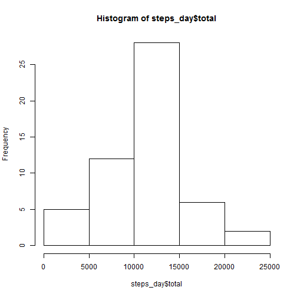
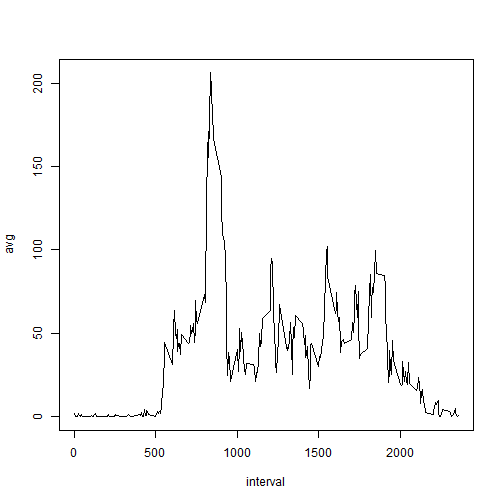
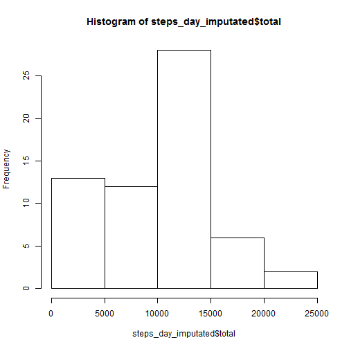
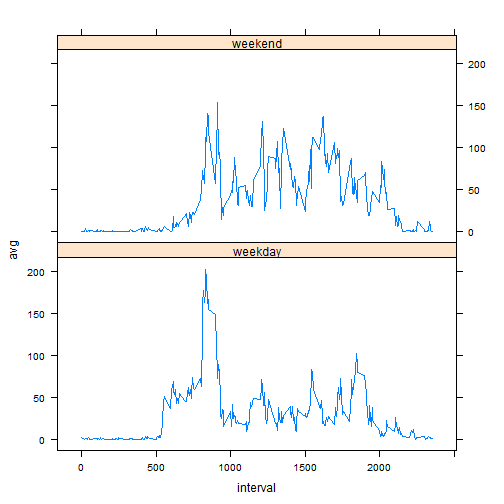

## Loading and preprocessing the data

The downloaded file repdata-data-activity.zip was unzipped into the working directory.


```r
activity = read.csv("activity.csv")
```

## What is mean total number of steps taken per day?

```r
library(dplyr)

activity_without_NA = filter (activity, !is.na(activity$steps))
steps_day = summarise (group_by(activity_without_NA, date),total = sum(steps))

hist(steps_day$total)
```

 

Mean total number of steps taken per day: 10766

Median total number of steps taken per day: 10765


## What is the average daily activity pattern?


```r
steps_interval = summarise(group_by(activity_without_NA,interval), avg = mean(steps))

plot(steps_interval, type = "l")
```

 

Interval, that contains the maximum number of steps: 835

## Imputing missing values

Number of missing values: 2304

The missing values were replaced by the nearest previuos value.


```r
activity_imputated = activity

last_value = 0
for (i in seq(from = 1, to = nrow(activity_imputated), by = 1)) {
  if  (is.na(activity_imputated[i,1])) 
    activity_imputated[i,1]=last_value
  else last_value = activity_imputated[i,1]
     
}

steps_day_imputated = summarise (group_by(activity_imputated, date),total = sum(steps))
hist(steps_day_imputated$total)
```

 

Mean total number of steps taken per day: 9354

Median total number of steps taken per day: 10395

The values are different. They are higher, because a lot of steps were added to the original dataset to fill the missing values.


## Are there differences in activity patterns between weekdays and weekends?

```r
Sys.setlocale("LC_TIME", "English")
```

```
## [1] "English_United States.1252"
```

```r
activity_imputated$WD = ifelse(test = weekdays(x = as.Date(activity_imputated$date), abbreviate = T) %in% c("Sun","Sat" ), yes = "weekend", no = "weekday")
 
library(lattice)
steps_interval_imputated = summarise(group_by(activity_imputated ,interval, WD), avg = mean(steps))
xyplot(avg~interval|WD, data=steps_interval_imputated, type = "l", strip = T, layout=(c(1,2)))
```

 
